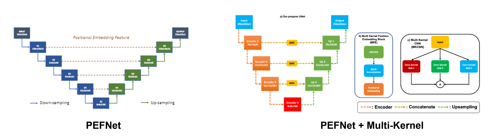
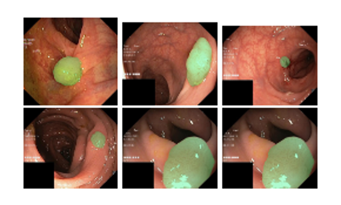

# PEFNet: Positional Embedding Feature for Polyp segmentation

This repo is the official implementation for:
1. [Multi Kernel Positional Embedding ConvNeXt for Polyp Segmentation](https://ieeexplore.ieee.org/document/10013883) (RIVF 2022).
2. [PEFNet: Positional Embedding Feature for Polyp Segmentation](https://link.springer.com/chapter/10.1007/978-3-031-27818-1_20) (MMM 2023).

Detail of each model modules can be found in original paper. Please citation if you use our implementation for research purpose.

## Overall architecture

Architecutre of PEFNet and PEFNet with Multi-Kernel module:

<div align="center">
    <a href="./">
        
    </a>
</div>

## Installation

Our implementation is on ``` Python 3.9 ``` , please make sure to config your environment compatible with the requirements.

To install all packages, use ``` requirements.txt ``` file to install. Install with ```pip ``` by the following command:

```
pip install -r requirements.txt
```

All packages will be automatically installed.

## Config

All of configs for training and benchmark are in ```./config/``` folder. Please take a look for tuning phase.

## Training

For training, use ``` train.py ``` file for start training.

The following command should be used:

```
python train.py
```

## Benchmark 

For benchmar, use ```test.py``` file for start testing.

The following command should be used:

```
python test.py
```

Note: you should fix model_path for your model path and directory to your benchmark dataset.

## Pretrained weights

The weight will be update later.

## Dataset

You can use Kvasir-SEG dataset for training, or CVC-clinic DB for training.

## Results

The IOU score on SOTA for Kvasir-SEG, this is our best model: 

| Model | IOU | Dice Coef |
| --- | --- | --- |
| PEFNet (MMM 2023) | 82.01 | 88.02 |
| PEFNet + Multi-Kernel (RIVF 2022) | 81.63 | 88.18|

Some results of visualization:

<div align="center">
    <a href="./">
        
    </a>
</div>

## Citation

```
@inproceedings{nguyen2022multi,
  title={Multi Kernel Positional Embedding ConvNeXt for Polyp Segmentation},
  author={Nguyen-Mau, Trong-Hieu and Trinh, Quoc-Huy and Bui, Nhat-Tan and Tran, Minh-Triet and Nguyen, Hai-Dang},
  booktitle={2022 RIVF International Conference on Computing and Communication Technologies (RIVF)},
  pages={731--736},
  year={2022},
  organization={IEEE}
}

@inproceedings{10.1007/978-3-031-27818-1_20,
  title={PEFNet: Positional Embedding Feature for Polyp Segmentation},
  author={Nguyen-Mau, Trong-Hieu and Trinh, Quoc-Huy and Bui, Nhat-Tan and Thi, Phuoc-Thao Vo and Nguyen, Minh-Van and Cao, Xuan-Nam and Tran, Minh-Triet and Nguyen, Hai-Dang},
  booktitle={MultiMedia Modeling},
  pages={240--251},
  year={2023},
  publisher={Springer Nature Switzerland}
}
```

